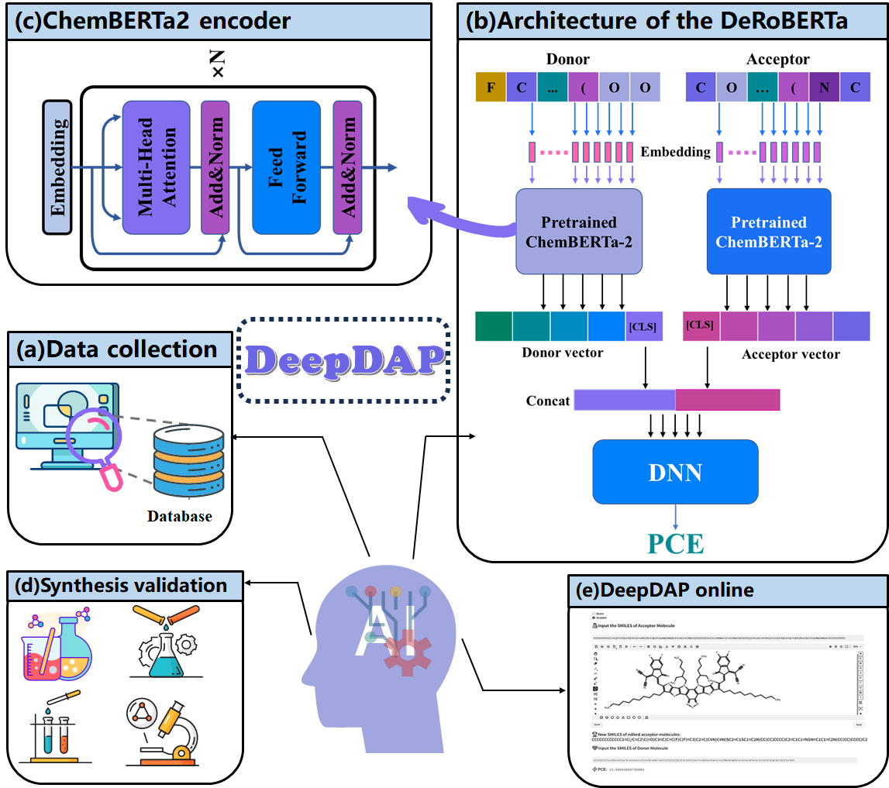

# BiBERTa

### **<u>Deep learning-assisted to accelerate the discovery of donor/acceptor pairs for high-performance organic solar cells</u>**



## <u>Motivation</u>

It is a deep learning-based framework built for new donor/acceptor pairs discovery. The framework contains data collection section, PCE prediction section and molecular discovery section. Specifically, a large D/A pair dataset was built by collecting experimental data from literature. Then, a novel RoBERTa-based bi-encoder model (BiBERTa) was developed for PCE prediction by using the SMILES of donor and acceptor pairs as the input. Two pretrained ChemBERTa2 encoders were loaded as initial parameters of the bi-encoder. The model was trained, tested and validated on the experimental dataset.

## <u>Depends</u>

We recommend to use [conda](https://conda.io/docs/user-guide/install/download.html) and [pip](https://pypi.org/project/pip/).

**By using the *requirements.txt* file, it will install all the required packages.**

```
git clone --depth=1 https://github.com/JinYSun/biberta.git
cd biberta
conda create --name biberta python3.11
conda activate biberta
conda install pip
pip install -r requirements.txt
```


## <u>Usage</u>

-- train:    contains the codes for training the model.

-- predict:    contain the code for screening large-scale DAPs.

-- test.ipynb:    contain the tutorials on predicting with models.

-- run:    contain the code to predict the performance of DAP one by one. 

-- dataset/OSC:	contain the dataset for training/testing/validating the model.

-- Demo/example.ipynb： contain the code to show how to train/test/screen the model.


## <u>Model Training</u>

```
cd BiBERTa
python train.py
```

## <u>Model Prediction</u>

large scale screening by inputting a file

```
python -c "import screen; screen.smiles_aas_test(r'BiBERTa/dataset/OSC/test.csv')"
```

predicting by input the SMILES of donor  and acceptor

```
python -c "import run; run.smiles_adp_test ('CCCCC(CC)CC1=C(F)C=C(C2=C3C=C(C4=CC=C(C5=C6C(=O)C7=C(CC(CC)CCCC)SC(CC(CC)CCCC)=C7C(=O)C6=C(C6=CC=C(C)S6)S5)S4)SC3=C(C3=CC(F)=C(CC(CC)CCCC)S3)C3=C2SC(C)=C3)S1','CCCCC(CC)CC1=CC=C(C2=C3C=C(C)SC3=C(C3=CC=C(CC(CC)CCCC)S3)C3=C2SC(C2=CC4=C(C5=CC(Cl)=C(CC(CC)CCCC)S5)C5=C(C=C(C)S5)C(C5=CC(Cl)=C(CC(CC)CCCC)S5)=C4S2)=C3)S1') "
```

[test.ipynb](https://github.com/JinYSun/BiBERTa/blob/branch/BiBERTa/test.ipynb):    contain the tutorials to show how to use the model for prediction.

## <u>web server</u> 

 The  web server of BiBERTa is available at [Hugging Face Space by jinysun](https://huggingface.co/spaces/jinysun/BiBERTa). Users can also use API to predict the PCE locally as follows:

First, it is supposed to install the client as follows.

```bash
pip install gradio_client
```

Then, users can also use API to predict the PCE locally as follows. It should be noted that the Hugging Face Space is must running instead of building or  the read operation will timed out .

```
from gradio_client import Client

'''
Predicting by using the SMILES of donor and acceptor, the size of file can't be too large.
'''

client = Client("jinysun/BiBERTa")
result = client.predict(
		acceptor="SMILES of acceptor",
		donor="SMILES of donor",
		api_name="/predict"
)
print(result)
```

```
from gradio_client import Client, handle_file

'''
Screening by using the file containing SMILES of donors and acceptors
'''

client = Client("jinysun/BiBERTa")
result = client.predict(
		file_obj=handle_file('Address of file to be screened'),
		api_name="/predict_1"
)
print(result)
```


## Demo

The [example.ipynb](https://github.com/JinYSun/DeepAcceptor/blob/master/abcBERT/Demo/example.ipynb) was used to show the whole process of abcBERT. The files in Demo were used to test that the codes work well. The parameters (such as epochs, dataset size) were set to small numbers to show how the abcBERT worked.

## <u>Discussion</u> 

The ***Discussion*** folder contains the scripts for evaluating the PCE prediction performance.  We compared sevaral methods widely used in molecular property prediction.


## <u>Contact</u>

Jinyu Sun. E-mail: [jinyusun@csu.edu.cn](mailto:jinyusun@csu.edu.cn)
