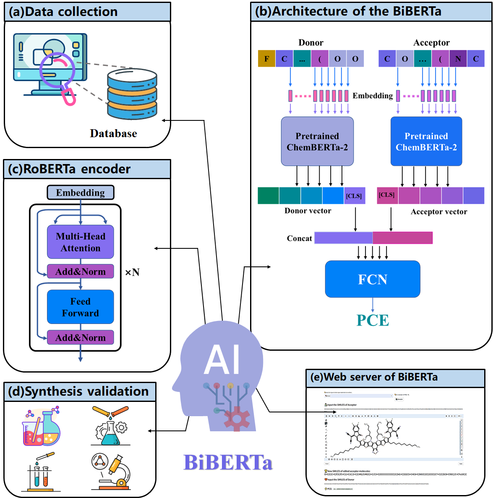

# BiBERTa

### **<u>Deep learning-assisted to accelerate the discovery of donor/acceptor pairs for high-performance organic solar cells</u>**



## <u>Motivation</u>

It is a deep learning-based framework built for new donor/acceptor pairs discovery. The framework contains data collection section, PCE prediction section and molecular discovery section. Specifically, a large D/A pair dataset was built by collecting experimental data from literature. Then, a novel RoBERTa-based bi-encoder model (BiBERTa) was developed for PCE prediction by using the SMILES of donor and acceptor pairs as the input. Two pretrained ChemBERTa2 encoders were loaded as initial parameters of the bi-encoder. The model was trained, tested and validated on the experimental dataset.

## <u>Depends</u>

We recommend to use [conda](https://conda.io/docs/user-guide/install/download.html) and [pip](https://pypi.org/project/pip/).

torch==1.10.0+cu113, 

pytorch-lightning==1.9.2, 

transformers==4.12.0,

numpy==1.20.0, 

pandas==1.4.3, 

curses=2.2.1+utf8,

scikit-learn==1.1.2,

scipy==1.4.1,

tqdm==4.66.1,

easydict==1.10

plotly==5.3.1

**By using the *requirements.txt* file, it will install all the required packages.**

```
git clone --depth=1 https://github.com/JinYSun/biberta.git
cd biberta
conda create --name biberta
conda activate biberta
pip install -r requirements.txt
```


## <u>Usage</u>

-- train:    contains the codes for training the model.

-- predict:    contain the code for screening large-scale DAPs.

-- run:    contain the code to predict the performance of DAP one by one. 

-- dataset/OSC:	contain the dataset for training/testing/validating the model.


## <u>Model Training</u>

```
from BiBERTa import train

train.main(using_wandb = False, hparams = 'config/config_hparam.json')
```

## <u>Model Prediction</u>

large scale screening by inputting a file

```
from BiBERTa import screen
screen.smiles_aas_test(r'DeepDAP/dataset/OSC/test.csv')
```

predicting by input the SMILES of donor  and acceptor

```
from BiBERTa import run
a = run.smiles_adp_test ('CCCCC(CC)CC1=C(F)C=C(C2=C3C=C(C4=CC=C(C5=C6C(=O)C7=C(CC(CC)CCCC)SC(CC(CC)CCCC)=C7C(=O)C6=C(C6=CC=C(C)S6)S5)S4)SC3=C(C3=CC(F)=C(CC(CC)CCCC)S3)C3=C2SC(C)=C3)S1','CCCCC(CC)CC1=CC=C(C2=C3C=C(C)SC3=C(C3=CC=C(CC(CC)CCCC)S3)C3=C2SC(C2=CC4=C(C5=CC(Cl)=C(CC(CC)CCCC)S5)C5=C(C=C(C)S5)C(C5=CC(Cl)=C(CC(CC)CCCC)S5)=C4S2)=C3)S1')                         
                    
```


## <u>Discussion</u> 

The ***Discussion*** folder contains the scripts for evaluating the PCE prediction performance.  We compared sevaral methods widely used in molecular property prediction.


## <u>Contact</u>

Jinyu Sun. E-mail: [jinyusun@csu.edu.cn](mailto:jinyusun@csu.edu.cn)
